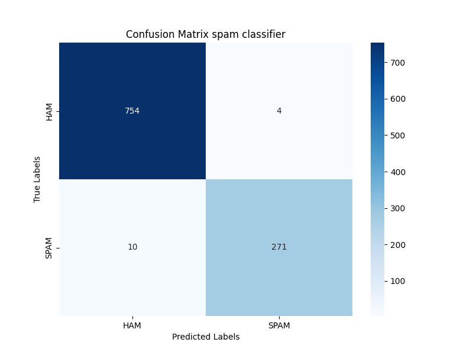
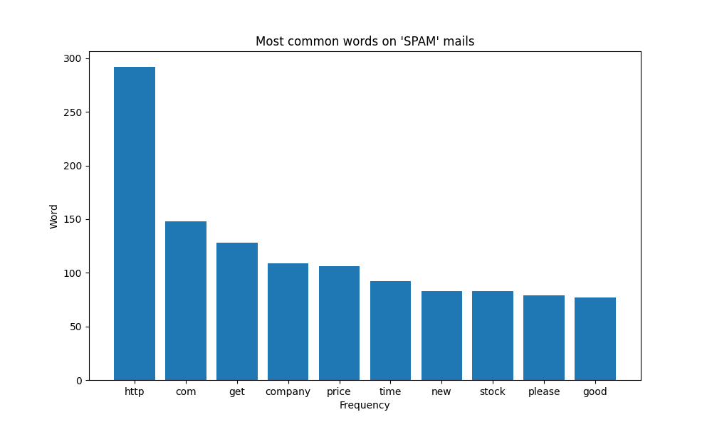

# Spam Ham Classifier

DMP (Data Management Plan) for the Spam Ham Classifier project:

[](https://doi.org/10.5281/zenodo.15292366)

## Index
- [Project Description](#project-description)
- [Context](#context)
- [Content](#content)
- [Model Details](#model-details)
  - [Model Description](#model-description)
  - [Uses](#uses)
  - [Out-of-Scope Use](#out-of-scope-use)
  - [Bias, Risks, and Limitations](#bias-risks-and-limitations)
  - [Recommendations](#recommendations)
  - [How to Get Started with the Model](#how-to-get-started-with-the-model)
- [Dataset](#dataset)
- [Training Details](#training-details)
  - [Training Data](#training-data)
  - [Training Procedure](#training-procedure)
  - [Validation Data](#validation-data)
- [Evaluation](#evaluation)
  - [Test Data](#test-data)
  - [Metrics](#metrics)
  - [Results](#results)
- [Output](#output)
- [Requirements](#requirements)
- [License](#license)

## Project Description

This project implements a spam email classifier using a Neural Network model. The model is trained on the [Spam Mail Dataset](https://www.kaggle.com/datasets/venky73/spam-mails-dataset/data) which has 5.171 emails that have been labeled as either spam or ham (non-spam). The goal is to accurately classify new emails based on their content.

## Context

The Spam Mail dataset is a collection of 5.171 emails that have been classified as spam or ham (non-spam). This dataset was originally created in 2006 for research purposes in the field of spam detection and filtering using machine learning techniques, specifically a Naive Bayes classifier as described in the paper "Spam Filtering with Naive Bayes - Which Naive Bayes?" by Metsis, Androutsopoulos, and Paliouras.

The data was created using mainly the inbox of 6 users of the company "Enron" for the "ham" emails, and the "spam" emails were collected from various sources, including the SpamAssassin corpus, the Honeypot project, the spam collection of Bruce Guenter, and spam collected by the authors themselves.
The emails were preprocessed to remove any html tags, and emails with non-latin characters were removed to avoid any possible bias since all "ham" emails are written with latin characters.

## Content
- `README.md`: This file.
- `requirements.txt`: A file listing the required Python packages and their versions for running the project.
- `output/`: Directory containing the output files generated during the training and evaluation of the model.
- `data/`: Directory containing the original "Spam Mail" dataset, which is used exclusively for generating the training, validation, and test sets.
- `data_preprocessing.ipynb`: A Jupyter Notebook for preprocessing the data, including lemmatization and stopword removal.
- `spam_email_detector.ipynb`: A Jupyter Notebook containing the code for training and evaluating the spam email classifier.
- `LICENSE`: The license file for the project.


## Model Details

### Model Description
- Developed by: Nicolas Bernal
- Model type: Neural Network Classifier (binary classification)
- Language(s) (NLP): English
- License: MIT License

### Uses
- Spam detection in email systems
- Filtering unwanted emails

### Out-of-Scope Use
- Spam detection in languages other than English
- Spam detection in non-email texts (e.g., SMS, social media)

### Bias, Risks, and Limitations

The model is trained only on English emails, and its performance may not be generalizable to other languages or types of text. Additionally, the adversarial examples used are quite outdated and may not represent current spam techniques. 

### Recommendations

It's recommended to use this model as a starting point for spam detection in English emails. For production use, consider retraining the model with more recent data and evaluating its performance on a diverse set of emails.

### How to Get Started with the Model

You can download the pretrained model (`spam_nn_model_v1.h5`) from TUWRD and use it to classify new emails. The model is saved in the HDF5 format, which can be loaded using TensorFlow/Keras.

**Link to TUWRD:**

[](https://handle.stage.datacite.org/10.70124/0e1sf-saz86)

```python
import tensorflow as tf
from tensorflow.keras.models import load_model

# Load the model
model = load_model('output/spam_nn_model_v1.h5')
```

## Dataset
Preprocessed data derived from the "Spam Mail" dataset, containing email messages labeled as spam or ham. Each record includes a unique identifier from the original "Spam Mail" dataset and an “experiment_id” indicating its assignment to a specific data split (training 70%, validation 10%, or test 20%) used in this experiment. The email content has been lemmatized and cleaned to remove noise such as punctuation, special characters, and stop words, ensuring consistent input for embedding and model training.

**Link to the dataset:**

[](https://handle.test.datacite.org/10.82556/j1ae-nx43)

## Training Details

### Training Data

Train set from the "Spam Mails" dataset, consisting of 3619 random entries (70% of the total data). Entries in this set have experiment_id values ranging from 0 to 3618.

**Link to the subset:**

[](https://test.dbrepo.tuwien.ac.at/database/7105b5ed-3020-42ad-8f67-f670c2f6fa18/subset/730fea6e-187a-11f0-b919-f68d2490d0da/info)


## Training Procedure
- Preprocessing: Stopword removal (english stopwords and punctuation symbols), stemming, and lemmatization.
- Embeddings: Tokenized words using `TfidfVectorizer` from Scikit-learn.
- Model: 
    - Architecture: 3 hidden layers with 15, 10, and 5 neurons respectively.
    - Activation function: ReLU for hidden layers and sigmoid for output layer.
    - Dropout: 0.2 dropout rate to prevent overfitting.
- Optimization: Adam optimizer.
- Training Hyperparameters:
    - Batch size: 32
    - Epochs: 20
    - Learning rate: 0.001
    - Loss function: Binary Crossentropy

### Validation Data

Validation set from the "Spam Mails" dataset, consisting of 512 random entries (10% of the total data). Entries in this set have experiment_id values ranging from 3619 to 4131. This set is used to tune the model's hyperparameters and evaluate its performance during training.

**Link to the subset:**

[](https://test.dbrepo.tuwien.ac.at/database/7105b5ed-3020-42ad-8f67-f670c2f6fa18/subset/08c5056c-187b-11f0-b919-f68d2490d0da/info)

## Evaluation

### Test Data

Test set from the "Spam Mails" dataset, consisting of 1038 random entries (20% of the total data). Entries in this set have experiment_id values ranging from 4132 to 5170.

**Link to the subset:**

[](https://test.dbrepo.tuwien.ac.at/database/7105b5ed-3020-42ad-8f67-f670c2f6fa18/subset/3c48ba6e-187b-11f0-a3a8-2ebef9ba1aed/info)

### Metrics
- Precision = `0.9855`
- Recall = `0.9644`
- Accuracy = `0.9865`
- F1-score = `0.9748`


### Results




## Output

- `confusion_matrix.png`: A confusion matrix that shows the performance of the model on the test set.
- `evaluation_metrics.txt`: Text summary of evaluation metrics: accuracy, precision, recall, and F1-score.
- `test_predictions.csv`: A CSV file that contains the predictions of the model on the test set.
- `top_spam_words.png`: A bar chart showing the top 10 most frequent words in correctly predicted spam emails.
- `spam_classifier.h5`: The trained model file, which can be used to make predictions on new emails.

## Requirements
- Python >= 3.11.9+
- Scikit-learn >= 1.6.1
- tensorflow >= 2.19

From the requirements.txt file, you can install all the required packages using pip:
```bash
pip install -r requirements.txt
```

## License
This project is licensed under the MIT License. See the [LICENSE](LICENSE) file for details.


